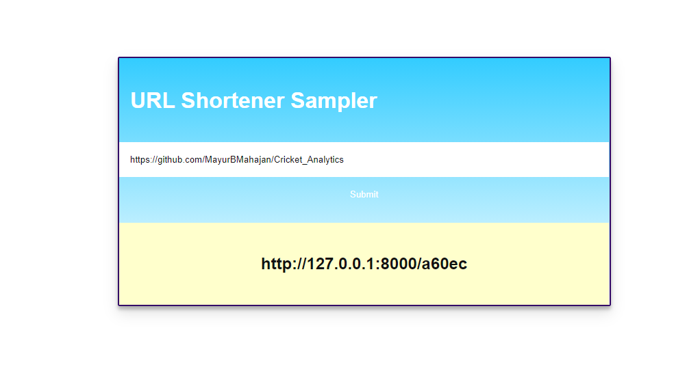

# Url-Shortner
Shorting longer URLs to smaller URLs

### Setuping project
* Create venv and python modules requirements from install requirements.txt 
* python manage.py migrate
* python manage.py createsuper   -- to visit admin panel and login to see user entries
* python manage.py runserver     -- to the the django server locally

### Sample output

